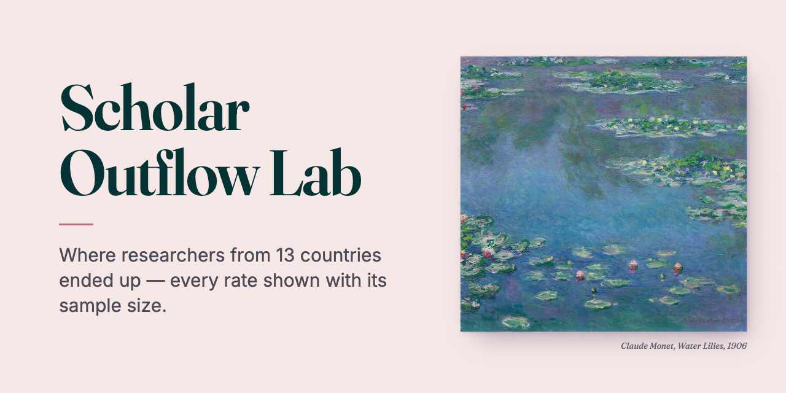
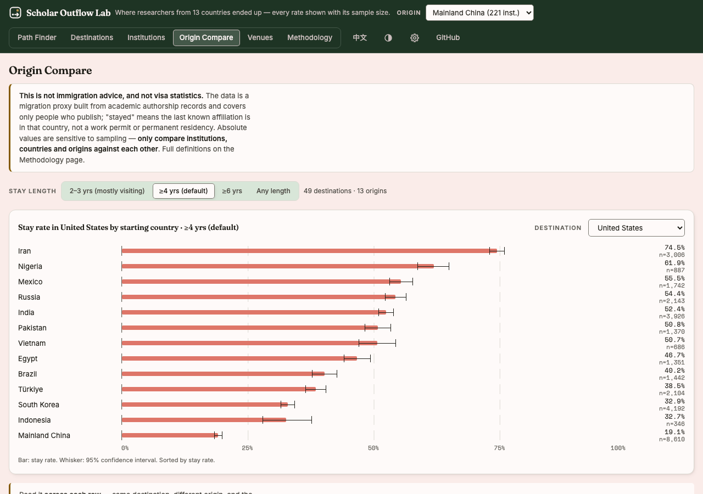
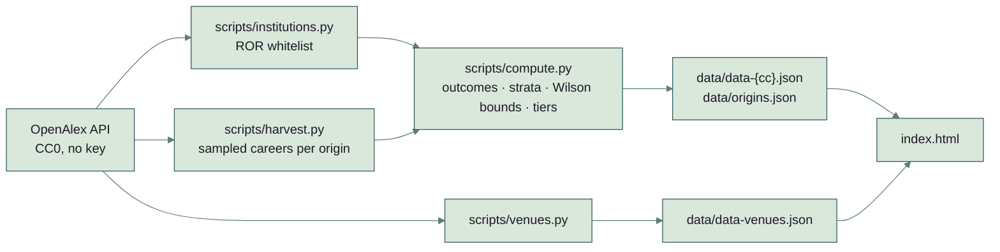

# Scholar Outflow Lab



**Where researchers from 13 countries ended up — every rate shown with its sample size.**

Researchers who started their careers in one country, followed by destination country and destination institution,
stratified by how long they stayed. Thirteen origin countries, 1.43 million sampled authors, built entirely on free
public data with a zero-dependency stack.

**Live:** https://nickkklian.github.io/Scholar-Outflow-Lab/ — English by default, 中文 toggle in the header.



---

## What it answers — and what it deliberately doesn't

It answers one narrow question well: *of researchers who began publishing in country X and later
held a position abroad, where did they end up, and how does that depend on how long they stayed?*

It does **not** answer "which country is easiest to immigrate to" or "what are a student's odds".
The sample is people with authorship records in [OpenAlex](https://openalex.org); anyone who left
before ever publishing at home is simply not in the frame, and "stayed" means *the last known
affiliation is in that country* — not a work permit or permanent residency. Every page says so.

## The finding worth seeing

The **Origin Compare** view puts the same destination side by side across origins. For stays of
four or more years in the United States:

| Origin | Stay rate | n |
|---|---|---|
| Iran | 74.5% | 3,006 |
| India | 52.4% | 3,926 |
| Brazil | 40.2% | 1,442 |
| Mainland China | 19.1% | 8,610 |

Same destination, same sampling, same computation — a three- to four-fold spread, and the
direction holds across the shared destinations. Because the *sample frames* differ by origin
(each is "people who once published under that country's affiliation"), the site is explicit
that only relative levels and direction are comparable, never the absolute percentages.

## How it's computed

| Term | Definition |
|---|---|
| **Sample** | Random sample of OpenAlex authors who ever published under an origin-country affiliation, with ≥5 works |
| **Home start** | The earliest career year includes the origin country |
| **Arrival** | A later foreign affiliation spanning ≥2 calendar years (a single year is treated as co-authorship, not a move) |
| **Observation window** | Only arrivals at least 5 years old count — otherwise "hasn't left yet" is misread as "stayed" |
| **Outcomes** | Four mutually exclusive classes on the final known affiliations: **Stayed** (destination only) · **Dual** (both) · **Returned** (origin only) · **Onward** (third country). They sum to 100% by construction |
| **Strata** | 2–3 years · ≥4 years (default) · ≥6 years · any |
| **Tiers** | Institutions ranked by the **Wilson 95% lower bound** of the default-stratum stay rate, cut into quartiles R1–R4 |
| **Whitelist** | 18,211 institutions with a ROR ID and adequate output, to filter the phantom affiliations OpenAlex parses out of free-text strings |

Two deliberate choices in the ranking: percentiles rather than absolute cutoffs (absolute values
drift with sampling; relative position within a batch is stable), and the confidence bound rather
than the raw rate (40% of 25 people versus 30% of 300 — ranking by the bound lets small-sample
flukes sink on their own, with no extra rules).

### Pipeline



`compute.py` refuses to publish when the careers file holds only part of a harvest, and
`scripts/daily.sh` runs the rounds on a schedule within the free quota.

### Download the data

The published JSON is the dataset, derived from OpenAlex's CC0 records. Every file sits in `data/`:
`data-{cc}.json` (one per origin, e.g.
[data-cn.json](https://nickkklian.github.io/Scholar-Outflow-Lab/data/data-cn.json)),
[origins.json](https://nickkklian.github.io/Scholar-Outflow-Lab/data/origins.json) (the origins and their
sample sizes) and
[data-venues.json](https://nickkklian.github.io/Scholar-Outflow-Lab/data/data-venues.json) (the venue
board). The Methodology page on the site links all of them.

## Three corrections that rescued the result

These are the reason the numbers are trustworthy, so they are documented rather than hidden.

1. **Dual affiliation had to become its own category.** The first version reported "stayed" and
   "did not return" as independent rates and produced *stayed 38% > did-not-return 25%* — a
   logical impossibility. The cause: a large share of Chinese researchers hold a foreign post
   *and* a home co-appointment at the same time. With four exclusive classes the totals are
   100% by construction and the numbers became self-consistent.
2. **Stratifying by length of stay is not optional.** The 2–3-year band is dominated by visiting
   scholars and joint-training students, who were always going home; pooled, they dilute every
   institution toward the same low rate. National University of Singapore, Chinese origin:
   **2.1%** stayed after 2–3 years (n=144), **10.7%** after ≥4 (n=289), **13.0%** after ≥6
   (n=185). The default stratum is ≥4 years for that reason.
3. **People already affiliated with the destination in their first year are not movers.**
   Without that filter, researchers who had always been in Taiwan or Hong Kong counted as
   "moved there and stayed" — 15.2% of ≥4-year arrivals — and a few Taiwanese universities
   topped the board. After the fix the top of the ranking returned to places that match
   intuition.

### And one hypothesis that did not survive

Early data suggested that much of computer science was being filed under "Engineering" because
the field label came from an author's *first* OpenAlex topic. The proposed fix — vote across all
topics — was implemented, and the entire Chinese sample was re-harvested under it
(235,059 authors, 31% larger than v1). Result: the share of CS relative to Engineering went from
15.6% to 14.5% — no improvement once sample growth is accounted for. The root cause is OpenAlex's
own topic→field taxonomy, which places applied CS under Engineering. The finding is recorded in
the pipeline comments so nobody re-runs the experiment, and the limitation is stated on the site.

## Known limitations

- A proxy built from academic affiliation records — not visa or immigration statistics, and not
  immigration or legal advice.
- The sample frame excludes anyone who left before publishing at home.
- Institutions are parsed by OpenAlex from affiliation strings; the ROR + output whitelist and a
  generic-name blacklist remove most mismatches, not all. Research institutes are noisier than
  universities, so the UI offers a "universities only" filter.
- Field labels are coarse (see above). Conference coverage in OpenAlex is thin.
- Absolute values drift with sampling choices; compare across institutions, countries and
  origins, not against external figures.

## Architecture

Zero cost, zero accounts, zero third-party packages.

| Layer | Choice | Why |
|---|---|---|
| Data | OpenAlex REST API, CC0 | Free, no key; 1,000 requests/day on the free tier |
| Processing | Python 3 standard library only | Nothing to install; the pipeline is the documentation |
| Front end | One static `index.html`, vanilla JS | Mobile-first, dark-mode aware, bilingual, deploys straight to GitHub Pages |
| Hosting | GitHub Pages from `main` | The computed JSON sits in `data/` beside the page; no server |
| Automation | launchd + a shell script | Runs once a week within the quota; see below |

```
index.html              single-file front end (EN/中文 toggle; data labels localised client-side)
data/data-<cc>.json     computed metrics per origin country — what the page reads
data/data-venues.json   journal / conference board (13,086 venues, 26 fields)
data/origins.json       manifest of generated origins — drives the origin switcher
scripts/harvest.py      sample author careers from OpenAlex → data/careers_<cc>.jsonl (resumable)
scripts/institutions.py institution whitelist (ROR + output floor + generic-name blacklist)
scripts/compute.py      aggregate → data/data-<cc>.json; idempotent, refuses to publish partial data
scripts/venues.py       venue board, ranked within field by h-index
scripts/traffic.py      weekly snapshot of GitHub traffic (the API only keeps 14 days)
scripts/daily.sh        the scheduled round, ordered by cost and unlock value
tools/check-css.mjs     finds classes the page renders with no rule, and rules nothing renders (run in CI)
```

The page sits in the repo root because GitHub Pages serves `main`'s root. `data/` holds the published
JSON, which is committed, and the intermediate JSONL (hundreds of MB), which is gitignored.

## Reproduce

```bash
export OPENALEX_MAILTO=you@example.com   # joins the OpenAlex polite pool; optional but faster
python3 scripts/institutions.py          # whitelist, once (~60 requests)
python3 scripts/harvest.py cn --seeds 24 # ~180k authors (~1,200 requests; resumable)
python3 scripts/compute.py cn            # offline
python3 -m http.server 8791              # http://localhost:8791
```

Swap `cn` for any ISO-3166 code (`in`, `ir`, `br`, …). **Mind the quota:** the free tier is 1,000
requests per day, and one origin at 24 seeds needs about 1,200 — split it across two days or use
`--seeds 12`. Hitting the limit exits cleanly with the reset time; re-running the same command
resumes from the last completed seed.

## Tests

```bash
python3 -m unittest discover -s tests -v
```

Standard library only, like the pipeline. Two layers:

- **The pipeline against a plan it did not write.** `tests/make_fixture.py` generates 200 synthetic careers
  (origin `xa`, a private-use code; `Synthetic University …` institutions) and decides every person's
  destination, length of stay and final affiliation itself, writing the counts it intended to
  `tests/fixtures/expected.json`. The real `scripts/compute.py` then runs on those careers and every published
  count and fraction has to match. Ten further records each hit one exclusion rule (single-year visit,
  arrival inside the follow-up window, already there in the first year, started abroad, …) and must count
  nowhere. Separate cases pin dual affiliation as its own outcome, the stratum boundaries, one count per person
  per country, ranking by the Wilson lower bound rather than the raw rate, the no-timestamp-only-rewrite guard
  and the partial-re-harvest guard.
- **Invariants on the data the site serves.** For all thirteen `data-<cc>.json` files: the four outcomes sum to
  100% (within rounding) for every country, institution and field block; each stay rate sits inside its
  interval; ranks follow the lower bound and tiers are the quartiles; strata nest; nothing below the
  publication floor is published; `origins.json` matches the files; and the headline table above is what the
  data says.

```bash
SOL_BREAK=1 python3 -m unittest discover -s tests
python3 tests/mutations.py
```

The first corrupts one fixture record and must fail. The second breaks one rule in `compute.py` or one number
in the published data at a time — 13 mutations — and requires the test guarding it to go red, so a
test that has stopped guarding anything is noticed.

## Automation, and what it learned the hard way

`scripts/daily.sh` runs once a week (launchd, Mondays 18:00 local — after the 00:00 UTC quota reset
in both daylight-saving regimes); until early September it ran every day. Tasks are ordered "cheapest
and most unlocking first", every step is resumable, and a run that runs out of quota simply continues
at the next one.

Three guards exist because each corresponding failure actually happened:

- **Never publish partial data.** During a multi-day re-harvest, `compute.py` uses whichever of
  the new file and its backup has more rows. The rule is dumb on purpose. The day before it
  existed, a harvest hit the quota at 19k of 180k authors, the recompute ran anyway, and the
  live site shrank from 175 institutions to 3.
- **Only commit when the substance changed.** The generated timestamp is excluded from the
  comparison. The daily job's first trial run committed and pushed a data file whose only change
  was that timestamp; left alone, every scheduled run would have done the same. The job also
  stages data files only — never source: an early version staged the page as well, and a
  hand-made front-end change went out under a "data update" message.
- **Derive the country list from the files on disk.** Two origins were once harvested in full and
  then never computed or published, because a hard-coded list in the recompute loop wasn't
  updated. The loop now scans for `careers_*.jsonl`.

The job is now in maintenance mode: all queued work is complete, so a weekly run does exactly two
things — snapshot traffic and run an idempotent recompute — with zero OpenAlex quota and zero
attention required.

## Data and license

Code: MIT. Data: [OpenAlex](https://openalex.org), CC0 public domain.
This project does not provide immigration, legal or financial advice.
